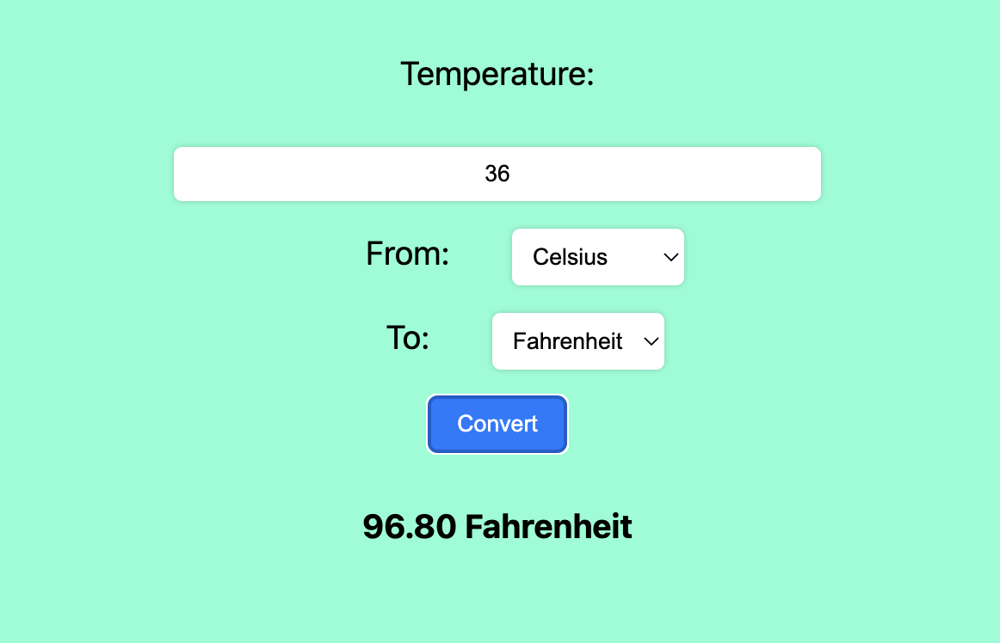

## Temperature Converter
Website that converts given temperature to the required unit


# Run Locally

Clone the project

```bash
  git https://github.com/H4K3R13/Temperature-Converter.git
```

Go to the project directory

```bash
  cd Temperature-Converter.
```

Open index.html using a webrowser

```bash
  firefox index.html
```

or

```bash
  google-chrome index.html
```

Screenshot


